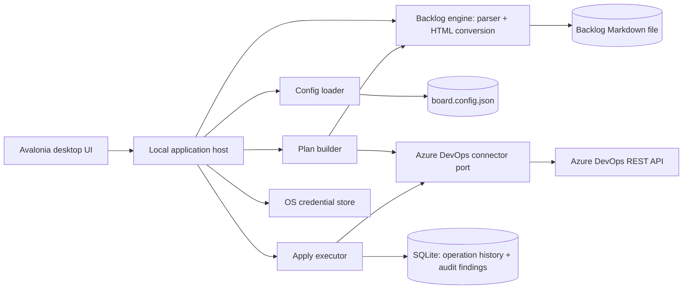

# Architecture: ADO Board Sync Desktop

**Status:** Draft

## 1. Recommended architecture

Use one modular local desktop application that ports the CLI's parsing, conversion, and command logic into typed .NET modules, verified against the Python implementation by parity tests. Keep Azure DevOps access behind a connector port, exactly as the CLI keeps it behind a single REST client module. Keep every mutation behind an explicit Plan-then-Apply gate — the desktop equivalent of the CLI's dry-run-then-`--go`.

## 2. Modules

| Module | Responsibility | Pattern | CLI equivalent |
| --- | --- | --- | --- |
| Board Profile Registry | Hold the known Board profiles, track the active one, and scope every command and query to it. | Aggregate + repository. | New — the CLI works one config at a time. |
| Config | Load and validate `board.config.json` against the schema; resolve credentials. | Value object + validator. | `config.py` |
| Backlog Watcher | Detect an external change to the backlog file or config and mark the profile stale. | File-system observer. | New — the CLI re-reads on every run. |
| Backlog Engine | Parse the Markdown backlog into Epics/Issues/Tasks; convert descriptions to HTML. | Parser + pure transform. | `parser.py`, `htmlfmt.py` |
| CSV Export | Write the import CSV from parsed items. | Pure transform. | `csvio.py` |
| Azure DevOps Connector | Read and write work items, iterations, and relations over the REST API. | Hexagonal adapter. | `client.py` |
| Plan Builder | Compute a typed create/update/delete/unchanged diff for a command, without mutating Azure DevOps. | Pure query over Backlog Engine output plus a board read. | dry-run branch of `commands.py` |
| Apply Executor | Execute a previously computed Plan; record outcomes. | Command handler. | `--go` branch of `commands.py` |
| Audit | Compute backlog-vs-board and hierarchy-state drift, read-only. | Specification pattern. | `audit` command |
| Operation History | Persist ApplyRun/ApplyOutcome/AuditFinding locally. | Append-only local store. | New — the CLI has no persistent history. |
| Credential Store | Resolve and store PAT references via the OS credential store, env var, or file. | Adapter, ordered fallback. | PAT resolution in `config.py` |

## 3. Design patterns

1. **Ports and adapters:** the Azure DevOps connector is the only module that knows about the REST API; the Backlog Engine and Plan Builder never import an HTTP client type.
2. **Plan/Apply (two-phase command):** every mutating command first produces an immutable Plan object; Apply consumes exactly that Plan. This is the CLI's dry-run/`--go` split, made a typed boundary instead of a stdout/flag convention.
3. **Anti-corruption layer:** the connector maps Azure DevOps work-item JSON to internal item types at the boundary; `types`/`states` config-driven names never leak past the connector.
4. **Parity verification:** the Backlog Engine, Config loader, CSV export, and Plan Builder are tested against fixture backlogs shared with the Python test suite; a golden-file test fails the build if the .NET output diverges from the CLI's output for the same input.
5. **Stale-plan guard:** a Plan carries a hash of the backlog content and the last board read it was computed against; Apply is rejected if either has changed, so Apply always executes what the user actually reviewed.
6. **Result type:** application-boundary operations return typed success, validation, authorization, rate-limit, and conflict results; exceptions are not used for expected outcomes (a duplicate code, a malformed markup block, a stale Plan).
7. **No outbox:** unlike ADO Insights' Teams delivery, there is no asynchronous send — Apply is synchronous and user-initiated, so no outbox/idempotency-key queue is needed for delivery. Import's existing idempotency (skip items that already exist) is preserved in the Plan Builder.

## 4. Data and storage

The Markdown backlog file and `board.config.json` remain the only sources of truth for board structure and configuration — exactly as in the CLI. The desktop app does not shadow either in a database; every Plan is computed fresh from the current file and a current board read.

SQLite, in a per-OS-user application-data directory, stores only what the CLI has no persistent form of: Operation history (ApplyRun/ApplyOutcome) and the last computed AuditFindings, for display without a live re-read. SQLite never stores the PAT, the backlog content, or `board.config.json` content — only references (Board profile path, credential-store key) and history metadata.

## 5. Azure DevOps connector rules

1. Reuse the CLI's REST semantics: WIQL for discovery, batch get/update, `api_version` from config, `max_retries`/`backoff`/`timeout` from config.
2. Plan generation only performs read calls (WIQL, batch get, iteration tree read). It never calls create/update/delete endpoints.
3. Apply performs exactly the write calls implied by the Plan it was given — no additional discovery, no re-planning mid-apply.
4. Iteration-node creation surfaces the same `TF50309`/ACL failure the CLI surfaces, with the same guidance (have an admin create the nodes, then Apply with node-creation skipped).
5. The connector never calls work-item delete except for the `dedup` Plan's explicit delete rows.

## 6. Security

- PAT resolution order: OS credential store entry for the Board profile, then `pat_env`, then `pat_file` — mirroring the CLI's env-var/file fallback, with the credential store as the preferred desktop-native option.
- The PAT is never written to SQLite, logs, exported files, or the backlog.
- Backlog titles and descriptions are treated as potentially sensitive; they are not written to structured logs beyond the item code.
- File writes (backlog, config) are atomic to avoid partial writes leaking on crash.
- Local audit events record every Plan generation and Apply, without capturing the PAT.

## 7. Observability

Emit structured logs and an exportable diagnostics bundle for: Plan generation duration and item count, Apply duration and per-item outcome, connector retry/backoff counts, rate-limit responses, Audit run duration and finding count, and file-write outcomes. Surface a local warning when the backlog changes on disk outside the app, and when a Plan goes stale before Apply.

## 8. Technology recommendation

| Layer | Recommendation | Reason |
| --- | --- | --- |
| Desktop host | .NET 10 and Avalonia UI | Matches ADO Insights; one cross-platform codebase for Windows/macOS/Linux. |
| Backlog editor | AvaloniaEdit (or an equivalent text-editing control) for source, a custom preview control driven by the ported HTML conversion | The preview must render exactly what the CLI would write — a generic Markdown preview control would diverge from ADO's actual rendering rules. |
| Application modules | .NET class libraries (Config, Backlog Engine, Plan Builder, Connector, Apply Executor) | Typed boundaries mirroring the CLI's module split. |
| Local history/audit store | SQLite | Portable, no server dependency, matches ADO Insights' local-storage choice. |
| Credential storage | Operating-system credential store | Keeps the PAT outside the database and source control, consistent with ADO Insights' security model. |
| Parity testing | Fixture-based golden-file tests run against both the .NET engine and the Python CLI | The desktop app's core value proposition is being a second surface over the same format — parity must be tested, not assumed. |
| Deployment | Signed local desktop package | Installs per user, no server dependency. |

## 9. Architecture risks

| Risk | Mitigation |
| --- | --- |
| Desktop engine drifts from the CLI's parsing/conversion/plan rules | Golden-file parity tests against fixture backlogs; treat any divergence as a release blocker. |
| A user bypasses the Plan/Apply gate through a future automation surface | Keep Apply's only entry point requiring a Plan ID computed against current state; no headless/scheduled Apply in v1. |
| Preview pane renders differently than Azure DevOps actually displays the description | Reuse the exact HTML conversion module for both preview and the write payload — never a second renderer. |
| Backlog edited externally while the app has it open | File-watch with change detection; block further edits until reload. |
| Stale Plan applied after a concurrent board change | Hash-check backlog and board state at Apply time; reject and require regeneration. |
| Iteration-tree ACL failures block Apply | Surface the same guidance the CLI gives; support `--assign-only`-equivalent partial Apply. |
| Credential storage migration for existing CLI users | Recognize existing `pat_env`/`pat_file` without requiring immediate migration to the credential store. |
