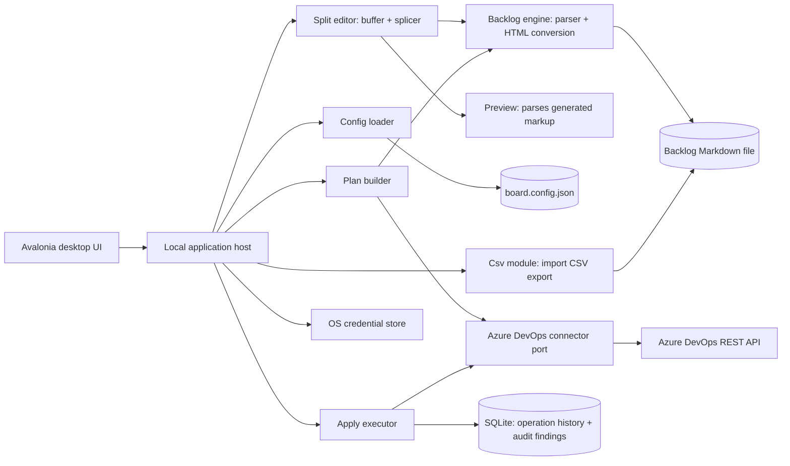

# Architecture: ADO Board Sync Desktop

**Status:** Approved — matches the code as built; the module table is the authoritative module list

**Date:** 2026-09-01 (rev 2)

## 1. Recommended architecture

Use one modular local desktop application that ports the CLI's parsing, conversion, and command logic into typed .NET modules, verified against the Python implementation by parity tests. Keep Azure DevOps access behind a connector port, exactly as the CLI keeps it behind a single REST client module. Keep every mutation behind an explicit Plan-then-Apply gate — the desktop equivalent of the CLI's dry-run-then-`--go`.

## 2. Modules

| Module | Responsibility | Pattern | CLI equivalent | Where it lives |
| --- | --- | --- | --- | --- |
| Config | Load and validate `board.config.json` against the schema; expose resolved paths and type/state names. | Value object + validator. | `config.py` | `AdoBoardSync.Core/Configuration` |
| Credential resolution | Resolve the PAT: session token, then `pat_env`, then `pat_file`. Ordered, never cached. | Adapter, ordered fallback. | PAT resolution in `config.py` | `AdoBoardSync.Core/Configuration` (`PatResolver`, `SessionPatSource`) |
| Backlog Engine | Parse the Markdown backlog into Epics/Issues/Tasks with per-item description-block ranges; convert descriptions to HTML; audit markup offline. | Parser + pure transforms. | `parser.py`, `htmlfmt.py`, `check-html` | `AdoBoardSync.Core/Backlog`, `AdoBoardSync.Core/Markdown` |
| Backlog Splicer | Rewrite one item's description block in the file text at the parser's own ranges, preserving line endings, trailing newline, and the blank separators between items. | Pure transform over parser ranges. | New — the CLI rewrites nothing. | `AdoBoardSync.Core/Backlog` (`BacklogSplicer`) |
| Csv module | Serialize the parsed backlog to the ADO web-importer CSV, byte-identical to `gen-csv`. | Pure transform. | `csvio.py` | `AdoBoardSync.Core/Csv` (`ImportCsv`) |
| Backlog Workspace | One open profile: config, backlog text, parsed items, the audit total that gates Apply; atomic save (temp + rename) with external-change refusal; CSV export to a path. | Record + file-boundary service. | New — the CLI reads once per run. | `AdoBoardSync.Desktop/Services` |
| Starter Backlog | Scaffold a working starter backlog when onboarding names a file that does not exist. | Pure content + one write. | New. | `AdoBoardSync.Desktop/Services` |
| Backlog File Store | The only filesystem access the application makes on a profile's behalf: read the backlog and `board.config.json`, write either one atomically (temp file, flush, rename), and stamp each read with its last-write time and a content hash. Decodes strictly as UTF-8 and never strips a byte-order mark, because `parser.py` does not either. | Hexagonal adapter behind a Core port. | implicit `open()` in `parser.py` / `config.py` | port in `AdoBoardSync.Core/Backlog` (`IBacklogFileStore`), adapter in `AdoBoardSync.Infrastructure` (`FileSystemBacklogFileStore`) |
| Profile Loader | Opens, reloads, saves and exports one profile asynchronously and cancellably through the file store, off the calling thread. Core is synchronous by design, so the asynchrony is the caller's. | Application service over a port. | one synchronous read per CLI run | `AdoBoardSync.Desktop/Services` (`ProfileLoader`) |
| Composition root | Binds every Core port to its adapter, once. Nothing else constructs an adapter. | Composition root. | New — the CLI wires itself in `cli.py`. | `AdoBoardSync.Desktop/Composition` (`AppServices`) |
| Azure DevOps Connector | Read and write work items over the REST API: WIQL discovery, batched gets carrying parent ids and the state/assignee/iteration fields the lifecycle commands plan against, JSON-Patch create with the never-retried parent link, retriable update, delete to the recycle bin, iteration-node creation and team sprint selection. | Hexagonal adapter. | `client.py` | `AdoBoardSync.Infrastructure` |
| Plan Builder | Compute a typed create/update/delete/unchanged diff for a command, without mutating Azure DevOps. Ported for `import`, `resync`, `resync-tasks`; the other commands follow. | Pure query over Backlog Engine output plus a board read. | dry-run branch of `commands.py` | `AdoBoardSync.Core/Planning` |
| Apply Executor | Execute a previously computed Plan; refuse stale plans; fan independent writes out with bounded concurrency while reporting outcomes in plan-row order. | Command handler. | `--go` branch of `commands.py` | `AdoBoardSync.Core/Planning` |
| Result type | Typed success/validation/authorization/rate-limit/conflict results; expected outcomes are not exceptions. | Result monad. | error tuples | `AdoBoardSync.Core/Results` |
| Python semantics | `re.match` anchoring and text-mode line splitting, stated once for every module ported from the CLI. | Static helpers. | implicit Python behaviour | `AdoBoardSync.Core/PythonCompat` |
| Description Preview | Render a description as it will read on the board, by parsing the generated markup. | Parser over Backlog Engine output. | New — the CLI writes without showing. | `AdoBoardSync.Desktop/Preview` |
| Shell + View models | Nav rail, backlog tree, split editor, Plan & Apply surface, onboarding. MVVM; no rule of its own. | MVVM over the modules above. | New — the CLI is a terminal surface. | `AdoBoardSync.Desktop/ViewModels`, `Views` |
| Board Profile Registry | Hold the known profiles, track the active one. | Aggregate + repository. | New | Planned (ABSD-502) |
| Backlog Watcher | Proactively detect external changes to the backlog or config. | File-system observer. | New | Planned (ABSD-504); save's conflict check is the interim guard |
| Audit | Compute backlog-vs-board and hierarchy-state drift, read-only. | Specification pattern. | `audit` command | Planned (ABSD-304) |
| Operation History | Persist ApplyRun/ApplyOutcome/AuditFinding locally. | Append-only local store. | New | Planned (ABSD-501) |
| OS Credential Store | Store PAT references in the OS keychain. | Adapter. | New | Planned (ABSD-103) |

**The preview parses generated markup, never the Markdown source.** A second
Markdown renderer could disagree with the Backlog Engine and show a user
something Azure DevOps will never receive, which would make the preview a lie at
exactly the moment it is load-bearing. `PreviewDocument` therefore parses the
HTML the connector would send. The converter's tag set is closed — `p`, `ul`,
`li`, `hr`, `table`, `tr`, `th`, `td`, `b`, `i`, `code` — so widening it is a
change this parser must be taught about, and a test asserts no text is lost
between the two.

**The editor's write path stays inside the parser's coordinates.** Each parsed
item carries the line range of its description block (start inclusive, end
exclusive, in text-mode-split lines — `PythonCompat.SplitLines`, not
`string.Split`). Editing recomputes derived views from a per-item buffer; Save
splices dirty buffers back through `BacklogSplicer`, last-to-first, because a
splice changes line counts and only descending order keeps the untouched
ranges valid. The splicer preserves the file's line-ending style, its trailing
newline, and the blank separator lines between items — which the parser counts
as part of a block but which render nothing. A round-trip test replaces every
block with its own lines and requires the file to come back byte-identical.

## 3. Design patterns

1. **Ports and adapters:** the Azure DevOps connector is the only module that knows about the REST API; the Backlog Engine, Plan Builder, and Csv module never import an HTTP client type.
2. **Plan/Apply (two-phase command):** every mutating command first produces an immutable Plan object; Apply consumes exactly that Plan. This is the CLI's dry-run/`--go` split, made a typed boundary instead of a stdout/flag convention.
3. **The file is the source of truth, enforced:** the buffer never reaches a Plan. `PlanViewModel` takes an unsaved-edits check from the shell and refuses before reading the board; Apply re-checks even after a confirmation. Save's external-change refusal is the same principle on the way out.
4. **Anti-corruption layer:** the connector maps Azure DevOps work-item JSON to internal item types at the boundary; `types`/`states` config-driven names never leak past the connector.
5. **Parity verification:** the Backlog Engine, Config loader, and Csv module are tested against the live Python modules on every build; `ParityCoverageTests` fails the build if a schema key or documented Markdown construct lacks a fixture.
6. **Stale-plan guard:** a Plan carries a hash of the backlog content and the last board read it was computed against; Apply is rejected if either has changed, so Apply always executes what the user actually reviewed.
7. **Result type:** application-boundary operations return typed success, validation, authorization, rate-limit, and conflict results; exceptions are not used for expected outcomes (a duplicate code, a malformed markup block, a stale Plan).
8. **Atomic local writes:** backlog and config writes go temp-file-then-rename in the destination directory, so a crash cannot leave a half-written file behind.
9. **No outbox:** Apply is synchronous and user-initiated, so no outbox/idempotency-key queue is needed. Import's existing idempotency (skip items that already exist) is preserved in the Plan Builder.

## 4. Data and storage

The Markdown backlog file and `board.config.json` remain the only sources of truth for board structure and configuration — exactly as in the CLI. The desktop app does not shadow either in a database; every Plan is computed fresh from the current file and a current board read.

SQLite, in a per-OS-user application-data directory (when ABSD-501 lands), stores only what the CLI has no persistent form of: Operation history (ApplyRun/ApplyOutcome) and the last computed AuditFindings. SQLite never stores the PAT, the backlog content, or `board.config.json` content — only references (Board profile path, credential-store key) and history metadata.

## 5. Azure DevOps connector rules

1. Reuse the CLI's REST semantics: WIQL for discovery, batch get/update, `api_version` from config, `max_retries`/`backoff`/`timeout` from config.
2. Plan generation only performs read calls (WIQL, batch get, iteration tree read). It never calls create/update/delete endpoints.
3. Apply performs exactly the write calls implied by the Plan it was given — no additional discovery, no re-planning mid-apply.
4. The create's `Hierarchy-Reverse` parent link is never retried (a retry can duplicate the item); updates and deletes of identified items are retriable, with the CLI's retry/backoff contract including `Retry-After`.
5. A rejected PAT arriving as HTTP 200 + sign-in HTML (HttpClient follows the redirect `http.client` does not) is mapped to `board.unauthorized`, not a JSON parse error.
6. Iteration-node creation surfaces the same `TF50309`/ACL failure the CLI surfaces, with the same guidance (have an admin create the nodes, then Apply with node-creation skipped).
7. The connector never calls work-item delete except for a Plan's explicit delete rows (`resync-tasks` stray deletes, `dedup`).

## 6. Security

- PAT resolution order: session token first, then `pat_env`, then `pat_file` — mirroring the CLI's env-var/file fallback, with the session entry as the desktop-native option and the OS credential store planned (ABSD-103).
- The PAT is never written to SQLite, logs, exported files, the config, or the backlog. The starter-backlog scaffold writes Markdown only.
- Backlog titles and descriptions are treated as potentially sensitive; they are not written to structured logs beyond the item code.
- File writes (backlog, config, CSV) are atomic or fail closed; save refuses to overwrite an external change rather than merging silently.
- Local audit events record every Plan generation and Apply, without capturing the PAT.

## 7. Observability

Emit structured logs and an exportable diagnostics bundle for: Plan generation duration and item count, Apply duration and per-item outcome, connector retry/backoff counts, rate-limit responses, Audit run duration and finding count, and file-write outcomes (including refused saves and stale-plan refusals). Surface a local warning when the backlog changes on disk outside the app, and when a Plan goes stale before Apply. (ABSD-507 owns the structured logging; today the status bar and error panel carry the same facts to the user.)

## 8. Technology

| Layer | Choice | Reason |
| --- | --- | --- |
| Desktop host | .NET 10 and Avalonia UI 12.1.1 | One cross-platform codebase for Windows/macOS/Linux; matches the reference implementation. 12.1.x rather than 11.x because 11.3.7 resolves a vulnerable `Tmds.DBus.Protocol` 0.21.2 and fails restore with NU1903 under `TreatWarningsAsErrors`. All Avalonia packages — `Avalonia`, `Avalonia.Desktop`, `Avalonia.Themes.Fluent`, `Avalonia.Fonts.Inter`, `Avalonia.Headless` — are pinned together at 12.1.1 through one property in `Directory.Packages.props`. |
| Source editor | Avalonia's own `TextBox`, **not AvaloniaEdit** | AvaloniaEdit is deliberately not taken: it is a second text stack to keep in lockstep with the Avalonia line, and the editor's requirement is a plain buffer whose changes recompute pure Core functions. Line-level gutter markers (ABSD-203's remainder) are the one feature that would justify it, and are scoped to be built against the existing control first. |
| Dependency injection | `Microsoft.Extensions.DependencyInjection` 10.0.0, referenced by `AdoBoardSync.Desktop` only | The composition root needs a container; Core must keep its zero-`PackageReference` csproj, which is the mechanical form of "Core depends on nothing". |
| Application modules | `AdoBoardSync.Core` (no HTTP/UI/storage), `AdoBoardSync.Infrastructure` (connector), `AdoBoardSync.Desktop` (host + MVVM) | Typed boundaries mirroring the CLI's module split; Core stays portable and parity-testable. |
| Editor + preview | Avalonia `TextBox` for the source buffer; a custom `PreviewPane` driven by the ported HTML conversion | The preview must render exactly what the CLI would write — a generic Markdown preview control would diverge from ADO's actual rendering rules. |
| Local history/audit store | SQLite (planned) | Portable, no server dependency. |
| Parity testing | `AdoBoardSync.Parity.Tests` runs the real Python modules via `parity_driver.py` on every build | The desktop app's core value proposition is being a second surface over the same format — parity must be tested, not assumed. |
| CommunityToolkit.Mvvm | Source-generated observable properties and relay commands | Keeps view models free of binding boilerplate and testable without a display. |

## 9. Architecture risks

| Risk | Mitigation |
| --- | --- |
| Desktop engine drifts from the CLI's parsing/conversion/CSV/plan rules | Golden-file parity tests against the live Python modules; treat any divergence as a release blocker. |
| The editor writes a file the parser would read differently | The splice uses the parser's own ranges; a round-trip test requires byte-identical reproduction; `BacklogSplicerTests` pins separators, EOL style, and multi-edit ordering. |
| A user bypasses the Plan/Apply gate through a future automation surface | Keep Apply's only entry point requiring a Plan ID computed against current state; no headless/scheduled Apply in v1. |
| Preview pane renders differently than Azure DevOps actually displays the description | Reuse the exact HTML conversion module for both preview and the write payload — never a second renderer. |
| Backlog edited externally while the app has it open | Save refuses on external change (`backlog.changed_on_disk`); the proactive watcher (ABSD-504) adds detection before a save attempt. |
| Unsaved buffer content silently planned or applied | The Plan gate checks the shell's unsaved state before generating and before applying; a Plan cannot exist for content that is not on disk. |
| Stale Plan applied after a concurrent board change | Hash-check backlog and board state at Apply time; reject and require regeneration. |
| Iteration-tree ACL failures block Apply | Surface the same guidance the CLI gives; support `--assign-only`-equivalent partial Apply. |
| Credential storage migration for existing CLI users | Recognize existing `pat_env`/`pat_file` without requiring immediate migration to the credential store. |
